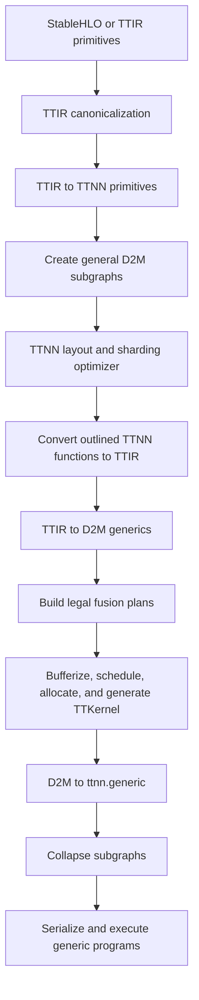

# General Graph Fusion for TT-MLIR and TTNN

Status: proposal

Audience: compiler, runtime, and kernel developers

## Summary

We should implement general fusion by extending the compiler's existing D2M
subgraph path, not by adding another family of semantic TTIR and TTNN
operations.

The proposed path is:

```text
primitive TTNN graph
    -> outline maximal D2M-compilable subgraphs
    -> choose layouts for each subgraph boundary
    -> lower the outlined graph through TTIR to D2M
    -> form one or more legal D2M fusion programs
    -> generate TTKernel data-movement and compute kernels
    -> serialize as ttnn.generic
    -> execute through the existing generic-op runtime
```

Adding a supported primitive operation should require a TTNN-to-TTIR
conversion and a TTIR-to-D2M lowering. It should not require a named fused
TTIR op, a named TTNN op, a new FlatBuffer operation, runtime dispatch cases,
or handwritten reader/compute/writer kernels.

The first implementation should target RoPE and RMSNorm, then extend the same
mechanism to GDN decode. GDN prefill and other bounded recurrent loops should
follow after the dataflow, aliasing, and multi-stage scheduling pieces are
stable.

## Motivation

The current specialized path works, but its implementation cost is high. A
new operation such as GDN currently spans several layers:

1. Match a frontend-specific StableHLO or TTIR graph.
2. Add a named TTIR operation.
3. Add a named TTNN operation and conversion.
4. Extend the TTNN FlatBuffer schema and serializer.
5. Add runtime dispatch and tensor lifetime handling.
6. Implement and maintain TT-Metal host code and dataflow kernels.
7. Repeat shape, dtype, sharding, cache, and runtime-argument validation.

This has three undesirable effects:

- Graph matchers become coupled to frontend spelling, shape conventions, and
  harmless reshapes or broadcasts.
- Each operation repeats compiler, schema, runtime, and kernel boilerplate.
- Performance improvements are trapped inside one semantic operation instead
  of improving every graph with the same dataflow structure.

RMSNorm and RoPE demonstrate the same issue at a smaller scale: their
mathematics consist mostly of already-supported primitive operations, but the
compiler recognizes a particular expansion and replaces it with a library
operation. Small frontend changes therefore require matcher changes even when
the underlying schedule is unchanged.

General fusion should make the graph and its iteration/dataflow structure the
source of truth. Semantic names may provide tuning hints, but must not be
required for correctness or code generation.

## Existing foundation

The pinned tt-mlir checkout already contains most of the required substrate:

- `TTNNCreateD2MSubgraphs` finds elementwise TTNN chains, outlines them into a
  private function, and replaces the chain with `ttnn.d2m_subgraph`.
- `ConvertTTNNToTTIR` converts operations inside those functions back to TTIR.
- `TTIRToD2M` lowers tensor operations to `d2m.generic` operations with grids,
  indexing maps, iterator types, and thread regions.
- `D2MGenericFusion` fuses elementwise generics and optionally fuses an
  elementwise producer into a single-dimension reduction.
- The D2M pipeline already handles bufferization, L1 allocation, scratch
  insertion, register scheduling, explicit data movement, and TTKernel
  generation.
- `D2MToTTNN` packages generated kernels, circular buffers, semaphores, and
  runtime arguments into `ttnn.generic`.
- The FlatBuffer and runtime already support `GenericOp` programs containing
  source-generated kernels.

The missing piece is therefore not a generic execution mechanism. The missing
piece is a general subgraph selection and fusion planner, plus broader
primitive lowering coverage.

There is one libtt-specific prerequisite: this repository currently stubs the
D2M frontend, backend, D2M-to-TTKernel, kernel-to-C++, and D2M-to-TTNN compiler
paths in `third_party/tt_xla/tt_mlir_compiler_cold_stubs.cc`. A production
implementation must link the required D2M and TTKernel compiler sources and
remove those stubs. The generic runtime path is already part of tt-mlir; the
libtt build should include only the compiler components required by this path
and measure the resulting shared-library size and link time.

## Goals

- Fuse graphs based on supported operations, indexing, effects, and resource
  constraints rather than model or operation names.
- Eliminate intermediate tensor materialization and external dispatch where
  profitable.
- Preserve exact program semantics unless an explicit fast-math policy allows
  a transformation.
- Fall back to ordinary TTNN operations whenever fusion is unsupported or
  unprofitable.
- Use the same infrastructure for elementwise chains, views, reductions,
  contractions, indexed access, and eventually bounded recurrent loops.
- Support multiple inputs and outputs, including results that alias mutable
  state operands.
- Make fusion decisions observable and testable.
- Keep hand-tuned library operations available when they are measurably
  better, without making them the only implementation.

## Non-goals

- Compiling arbitrary StableHLO, dynamic control flow, or arbitrary dynamic
  shapes in the first version.
- Replacing highly optimized collectives, large matrix multiplications, or
  convolution implementations immediately.
- Reassociating floating-point expressions by default.
- Guaranteeing that every outlined subgraph becomes one kernel. One
  `ttnn.generic` program may contain multiple data-movement and compute
  kernels, and an unprofitable subgraph may be split.
- Removing all semantic composites. A composite can remain as an optional
  canonical form or scheduling hint if it also has a primitive decomposition.

## Proposed architecture

### 1. Keep `ttnn.d2m_subgraph` as the fusion boundary

We should generalize `TTNNCreateD2MSubgraphs` rather than add a parallel
`ttir.fusion` operation. The existing operation already provides:

- an explicit list of live-in tensors;
- destination-style output buffers and result tensors;
- an outlined function that can be compiled in isolation;
- a boundary that the TTNN layout optimizer can reason about; and
- a path back to `ttnn.generic` that does not require a new runtime schema.

For example, an expanded RMSNorm graph would be outlined as:

```mlir
%result = ttnn.d2m_subgraph @fusion_17
    ins(%x, %gamma, %epsilon : tensor<...>, tensor<...>, tensor<...>)
    outs(%out : tensor<...>) : tensor<...>

func.func private @fusion_17(%x: tensor<...>, %gamma: tensor<...>,
                             %epsilon: tensor<...>) -> tensor<...> {
  %square = ttnn.multiply %x, %x
  %mean = ttnn.mean %square {dim = [-1], keep_dim = true}
  %biased = ttnn.add %mean, %epsilon
  %scale = ttnn.rsqrt %biased
  %normalized = ttnn.multiply %x, %scale
  %result = ttnn.multiply %normalized, %gamma
  return %result
}
```

After nested D2M compilation and collapse, the call site contains a
`ttnn.generic` program. There is no `ttir.rms_norm` or `ttnn.rms_norm`
requirement in this path.

### 2. Replace the hard-coded elementwise list with an interface

The current subgraph pass uses a C++ `isa` list to decide which TTNN
operations are eligible. Replace it with a `D2MFusibleOpInterface` (the exact
name is not important) implemented by TTNN operations that have a valid
primitive lowering.

The interface should expose only facts needed before D2M lowering:

```cpp
enum class FusionClass {
  View,
  Pointwise,
  Reduction,
  Contraction,
  Indexed,
  Stateful,
  ControlFlow,
};

struct FusionConstraints {
  FusionClass fusionClass;
  bool requiresStaticShape;
  bool permitsMultipleUsers;
  bool permitsInPlace;
};
```

Standard MLIR interfaces should remain authoritative for memory effects,
destination operands, and aliasing. The new interface should not duplicate
`MemoryEffectOpInterface` or `DestinationStyleOpInterface`.

Eligibility must also query whether a TTNN-to-TTIR conversion and TTIR-to-D2M
lowering exist for the concrete shape, dtype, layout, and target architecture.
A declared interface without a valid lowering is a compiler error in tests,
not a runtime surprise.

Named composites need one of two behaviors:

- stay expanded when general fusion is enabled; or
- implement a decomposition hook that emits the same primitive graph inside
  the outlined function.

This decomposition is a migration aid. The fusion planner itself must not
depend on identifying “RMSNorm”, “RoPE”, or “GDN”.

### 3. Outline maximal compilable regions, not maximal final fusions

Subgraph discovery should conservatively outline connected regions of
D2M-compilable operations before TTNN layout optimization. Outlining is not a
promise that every operation will be fused into one program.

The high-level partitioner should:

1. Walk operations in block order and build a data-dependency graph.
2. Stop at host operations, collectives, unsupported operations, incompatible
   devices or meshes, and unmodelled side effects.
3. Include view operations even when they do not generate code.
4. Permit multiple inputs and multiple externally visible outputs.
5. Avoid duplicating expensive producers with external users; cheap views and
   scalar operations may be cloned when profitable.
6. Record state ordering and aliases rather than rejecting all mutation.

The D2M planner then makes the final decisions with exact indexing maps,
blocking, grids, tile types, and resource estimates available.

### 4. Generalize D2M fusion from pairwise inlining to fusion plans

`D2MGenericFusion` currently merges producer and consumer generics when their
iteration spaces can be composed. Keep that fast path, but represent the
result of planning explicitly:

```cpp
struct FusionPlan {
  SmallVector<d2m::GenericOp> operations;
  SmallVector<FusionEdge> edges;
  ResourceEstimate resources;
  Schedule schedule;
};

enum class FusionEdgeKind {
  View,       // compose indexing maps; no storage
  Register,   // forward a tile/value in the same loop nest
  Scratch,    // retain a bounded intermediate in L1/CB storage
  External,   // materialize a tensor and split the plan
};
```

The planner needs three merge modes:

#### View composition

Reshape, broadcast, transpose, slice, and concatenate should become affine or
piecewise-affine indexing where possible. They should not allocate an
intermediate tensor or consume a kernel stage merely because the frontend
spelled the indexing differently.

#### Inline fusion

Operations with compatible iteration spaces pass tiles or scalar values
directly through registers. This is the existing elementwise fusion model and
also covers an elementwise producer folded into a reduction.

#### Staged fusion

Operations with different iteration spaces remain separate loop nests or
kernel stages inside one program. Their intermediate is held in a bounded
scratch buffer or circular buffer rather than materialized as a full external
tensor. This is required for:

- reduction followed by elementwise work in RMSNorm;
- contraction or reduction followed by an update in GDN;
- producer/consumer pairs whose grids differ but can communicate on-chip; and
- multiple reductions or contractions in a single recurrent update.

The existing D2M scratch, spill, stream, scheduler, and allocator passes
already provide much of the machinery needed after a staged plan is formed.
The planner should describe lifetimes and dependencies; those downstream
passes should choose concrete CB ports and L1 addresses.

### 5. Separate legality from profitability

A fusion is legal only when all of the following hold:

- Every operation has a supported lowering for the target architecture,
  dtype, tile shape, and math mode.
- Indexing maps compose or an explicit staged dataflow edge can be built.
- Device, mesh, and sharding contracts are compatible.
- Memory effects have a valid order and all aliases are explicit.
- The plan stays within kernel, circular-buffer, semaphore, DST-register, and
  L1 limits.
- Padding and masking semantics remain valid at logical tensor boundaries.
- The generated program has a valid layout for every live-in, live-out, and
  scratch value.

Profitability is evaluated only after legality. A first cost model can use:

- host dispatches removed;
- DRAM and L1 bytes no longer written and reread;
- full intermediates replaced by bounded scratch;
- extra computation caused by cloning or recomputation;
- synchronization and cross-core communication introduced;
- peak CB, L1, and DST pressure;
- generated code size; and
- an estimated or measured runtime from the existing D2M/TTNN op model.

Resource limits are hard constraints, not weighted costs. The planner should
split a candidate at the cheapest edge when a full plan does not fit.

The initial heuristic can greedily merge the legal edge with the largest
estimated saved bytes. The design should allow beam search or profile-guided
selection later without changing the IR.

### 6. Model mutation and aliases explicitly

Pure graphs are the simplest starting point, but GDN requires state updates.
The subgraph boundary must describe which result aliases which input or output
buffer. This can be represented with destination-style output operands plus
an alias attribute or a standard bufferization alias interface.

Within D2M, state access should be expressed as primitive indexed reads and
writes with memory effects. The planner must preserve dependencies such as:

```text
read old state -> compute delta -> write new state -> read new state for output
```

State-pool gather/select/scatter idioms should first be canonicalized to
explicit indexed state reads and updates. That canonicalization is useful to
all recurrent algorithms and should not name GDN. A state result that is
mutated in place should remain an SSA result for ordering, while bufferization
records that it aliases the input pool.

The current `ttnn.d2m_subgraph` and optimizer need full multiple-result and
alias support before this path can replace the specialized GDN decode
operation. Some current layout utilities assume one result; those assumptions
must be removed rather than worked around in a GDN-specific conversion.

### 7. Preserve numerical semantics

Fusion must not silently change the computation.

- Preserve the original operation order unless fast math explicitly permits
  reassociation.
- Carry accumulator dtype, destination dtype, math fidelity, and approximate
  math mode into the fusion plan and cache key.
- Keep reductions in FP32 where the unfused graph uses FP32 accumulation.
- Apply masking before reductions so padded tile elements do not contribute.
- Make typecasts and rounding points explicit; do not erase a cast solely
  because producer and consumer are fused.
- Preserve deterministic state-update ordering.

Exact bitwise identity will not always be possible when the existing TTNN
library operation uses a different reduction tree. Each operation class needs
an explicit correctness contract: bitwise, absolute/relative tolerance, or
model-level equivalence.

### 8. Make fallback transactional

Fusion must remain an optimization. Failure to fuse must not make a supported
model fail to compile.

Candidate formation and planning should operate on an isolated clone or keep
the original operations until a plan verifies. The fallback order is:

1. one fused generic program;
2. several smaller generic programs;
3. the original TTNN operations; and
4. an existing specialized operation, when selected by the normal TTNN path.

Unsupported primitive lowerings should be detected before outlining. A
failure during generated-kernel compilation should produce a diagnostic with
the structural fusion signature and retry the unfused path when compilation
is still transactional.

### 9. Cache by structure, not semantic name

Generated programs should be keyed by a canonical structural signature that
includes:

- primitive operation graph and attributes;
- shapes, dtypes, layouts, and shardings;
- target architecture and worker grid;
- math fidelity and approximation flags;
- alias and memory-effect information; and
- chosen schedule and resource parameters.

The serialized program can continue to carry inline generated kernel source,
as supported by the existing TTNN kernel interface. TT-Metal's program cache
then caches compiled artifacts. A compiler-side persistent cache can be added
later using the same structural key.

## How the target operations map to the design

### RoPE

RoPE is the easiest first nontrivial target. After normalization it is mostly
views plus pointwise multiply, negate, and add operations:

```text
slice/rotate-half(x) * sin + x * cos
```

Slices, concatenation, reshapes, and broadcasts become indexing maps. The
remaining arithmetic shares one parallel iteration space and uses inline
fusion. Position-dependent cache selection may require an indexed read, but
does not require a rotary-embedding kernel.

Success means rank-3 and rank-4 frontend spellings produce the same structural
plan without extending a RoPE matcher.

### RMSNorm

RMSNorm exercises both inline and staged fusion:

```text
x*x -> reduce_mean(last_dim) -> +epsilon -> rsqrt -> *x -> *gamma
```

The square can be inlined into the reduction. The reduction result is one
value or tile fragment per row and is retained in scratch for the downstream
pointwise stage. `x` may be streamed again or retained depending on L1 and CB
pressure. Gamma is broadcast through its indexing map.

This requires reduction-to-elementwise staged fusion, but no RMSNorm-specific
kernel. The same capability benefits LayerNorm, variance computations, softmax
epilogues, and many loss functions.

### GDN decode

GDN decode is a later, stronger test of the architecture. Its graph contains:

- indexed recurrent-state reads and writes;
- decay and beta pointwise arithmetic;
- matrix-vector reductions;
- an outer-product-like state update;
- two externally visible results, one of which aliases state; and
- strict ordering between update and output computation.

A general plan can lower this as several stages in one program: read and
decay state, compute the first reduction, compute the delta and state update,
then compute the output reduction. Bounded intermediates stay in registers or
scratch, and the state pool is updated through an explicitly aliased output.

The scheduler may need GDN-like schedule candidates, but they should be
described in structural terms such as “matrix-vector reduction followed by
rank-one update,” not selected by an operation name. The current specialized
GDN implementation should remain as a performance oracle and fallback until
the generated plan is competitive.

### GDN prefill and bounded loops

The prefill rule includes a bounded recurrence. It should be addressed after
decode by supporting statically bounded `scf.for`/affine loops inside an
outlined subgraph. The recurrence-carried state must have an explicit alias
and lifetime. Static unrolling can remain a planner choice, not a frontend
matcher requirement.

## Proposed pipeline



Semantic TTIR fusion should be disabled for operations claimed by this path,
or the semantic operation must be decomposed inside the outlined function.
Running both semantic replacement and structural fusion without a clear
precedence would hide optimization opportunities and make behavior dependent
on pass order.

## Implementation plan

### Phase 0: enable and measure the existing generic path in libtt

- Link the required D2M, TTKernel transform/codegen, and D2M-to-TTNN compiler
  sources in the Bazel build.
- Remove the corresponding unsupported cold stubs.
- Enable `TTNNCreateD2MSubgraphs` and D2M elementwise fusion behind an
  experimental option.
- Validate a small elementwise graph end to end through `ttnn.generic`.
- Record build time, `libtt.so` size, compile latency, runtime, and cache-hit
  behavior.

Exit criterion: existing elementwise graphs execute correctly through the
generic runtime with no specialized operation added.

### Phase 1: general discovery and view fusion

- Add the fusibility/lowerability interface and remove the hard-coded
  elementwise `isa` list.
- Support multiple inputs and outputs in subgraph selection and layout
  propagation.
- Compose reshape, broadcast, transpose, slice, and concatenate indexing.
- Add structural diagnostics and fusion-plan dumps.
- Use RoPE as the first end-to-end target.

Exit criterion: expanded rank-3 and rank-4 RoPE graphs compile to generated
programs and match the existing implementation's correctness and performance
within an agreed threshold.

### Phase 2: staged reduction fusion

- Generalize D2M fusion planning beyond pairwise inline fusion.
- Support reduction-to-pointwise staged edges and bounded scratch lifetimes.
- Connect the planner to the existing scratch, spill, allocator, and scheduler
  passes.
- Enable and validate RMSNorm, then test LayerNorm and softmax fragments to
  prove the implementation is not RMSNorm-specific.

Exit criterion: RMSNorm uses no RMSNorm-specific kernel and does not
materialize full-size intermediate tensors.

### Phase 3: stateful and contraction fusion

- Add explicit result-to-operand alias modeling at the subgraph boundary.
- Add primitive indexed state reads and writes.
- Support contraction/reduction, pointwise update, and subsequent reduction
  in one staged plan.
- Remove single-result assumptions from D2M subgraph layout utilities.
- Use GDN decode as the main target and add a second stateful workload to
  prevent semantic special-casing.

Exit criterion: GDN decode correctness passes the recurrent-state tests and
generated performance is close enough to the specialized implementation to
run full-model benchmarks.

### Phase 4: cost model, tuning, and bounded control flow

- Integrate measured D2M op costs and profile-guided plan selection.
- Add schedule candidate search and persistent structural caching.
- Support statically bounded loops and recurrent state for GDN prefill.
- Expand to matmul epilogues and other contraction/pointwise graphs where the
  generated plan beats separate TTNN operations.

## Testing and observability

The implementation needs coverage at four levels.

### IR and legality tests

- Expected subgraph boundaries for branching and multi-output graphs.
- View/indexing-map composition.
- Accept/reject tests for effects, aliases, unsupported dtypes, incompatible
  shardings, CB limits, DST pressure, and L1 exhaustion.
- Verification that rejected candidates leave the original graph unchanged.

### Generated-program tests

- D2M-to-TTKernel lowering and C++ translation for every primitive tile op.
- FlatBuffer round trips for kernels, CBs, semaphores, scalar arguments, and
  aliased tensors.
- Program-cache key stability and invalidation.

### Differential correctness tests

- Randomized comparison against unfused JAX/StableHLO and unfused TTNN.
- Padding, partial tiles, zero-length logical dimensions where supported,
  minimum/maximum batch sizes, and multiple state indices.
- BF16, FP32 accumulation, approximation modes, and deterministic mutation.
- Long-running recurrent tests that detect state drift rather than checking
  only one token.

### Performance tests

- Per-operation cold compile time and warm execution time.
- Full-model TTFT, inter-token latency, and tokens per second.
- External bytes transferred, number of program dispatches, L1 peak, CB count,
  and kernel count.
- Comparisons against both unfused execution and the current specialized
  implementation.

Every rejected merge should optionally emit a structured reason such as
`unsupported-lowering`, `external-user`, `incompatible-indexing`,
`cb-limit`, `dst-limit`, `l1-limit`, `alias-order`, or `not-profitable`.
Without this, a general fusion pass will become difficult to tune and debug.

## Acceptance criteria

| Area | Required outcome |
| --- | --- |
| Correctness | Fusion is numerically within the operation's declared contract and preserves state ordering. |
| Fallback | Disabling or rejecting fusion leaves a valid ordinary TTNN program. |
| Maintenance | A new graph made only from supported primitives requires no new FlatBuffer operation or runtime dispatch case. |
| Performance | RoPE and RMSNorm are competitive with existing library paths; GDN decode is measured against the current specialized baseline. |
| Generality | At least one non-target workload exercises each new capability: view fusion, staged reduction fusion, and stateful fusion. |
| Diagnostics | The compiler can dump selected groups, schedules, resource estimates, and rejection reasons. |

## Alternatives considered

### Continue adding named fused operations

This gives maximum control and is appropriate for a small number of critical
operations, but it repeats the entire compiler/runtime/kernel stack and keeps
frontend-sensitive matchers on the critical path. It should remain an escape
hatch, not the default implementation strategy.

### Fuse only at the TTNN runtime

Runtime fusion lacks the high-level indexing, effect, and numerical
information needed for safe general planning. It also makes persistent
compilation and diagnostics harder. Runtime and program caches should consume
compiler-generated plans, not rediscover graphs.

### Generate C++ kernels directly from TTIR

This would bypass D2M but duplicate its grid selection, data movement,
bufferization, scratch allocation, register scheduling, and TTKernel lowering.
Extending the existing D2M path is smaller and gives improvements to upstream
tt-mlir as well as libtt.

### Use TTNN tracing without kernel fusion

Tracing reduces host dispatch overhead but does not remove intermediate tensor
traffic or enable register/scratch forwarding. It is complementary and should
remain enabled around generated programs.

## Risks and open questions

- Linking D2M code into libtt may materially increase binary size, build time,
  or cold compile latency. Phase 0 must quantify this before deeper work.
- Current D2M fusion and allocation are still evolving. General staged fusion
  may expose scheduler and allocator assumptions that simple elementwise
  fusion does not.
- Layout optimization currently treats a subgraph as a coarse operation.
  Multi-output and aliased-state layouts need a joint constraint model.
- Generated kernels may initially trail mature TTNN library kernels. We need
  clear performance gates and should keep specialized fallbacks during the
  transition.
- Structural schedule search needs bounded compile time. A small deterministic
  candidate set should precede autotuning.
- It remains to be decided whether scalar runtime values are passed as true
  scalar arguments or one-element tensors throughout the serialized path.
- Multi-device fusion should initially stop at collectives. Extending generic
  programs across a mesh requires separate communication and synchronization
  design.

## Recommendation

Proceed incrementally using the existing `ttnn.d2m_subgraph` and
`ttnn.generic` infrastructure. First prove that libtt can compile and execute
the existing elementwise D2M path at acceptable build and compile cost. Then
generalize discovery and indexing with RoPE, add staged reduction fusion with
RMSNorm, and finally add alias-aware staged contraction fusion with GDN decode.

Keep the current specialized GDN kernels as a correctness and performance
oracle until the generic path passes the same recurrent tests and full-model
benchmarks. Once it does, the semantic GDN TTIR/TTNN/runtime stack can be
removed without changing the model graph or generic runtime.
