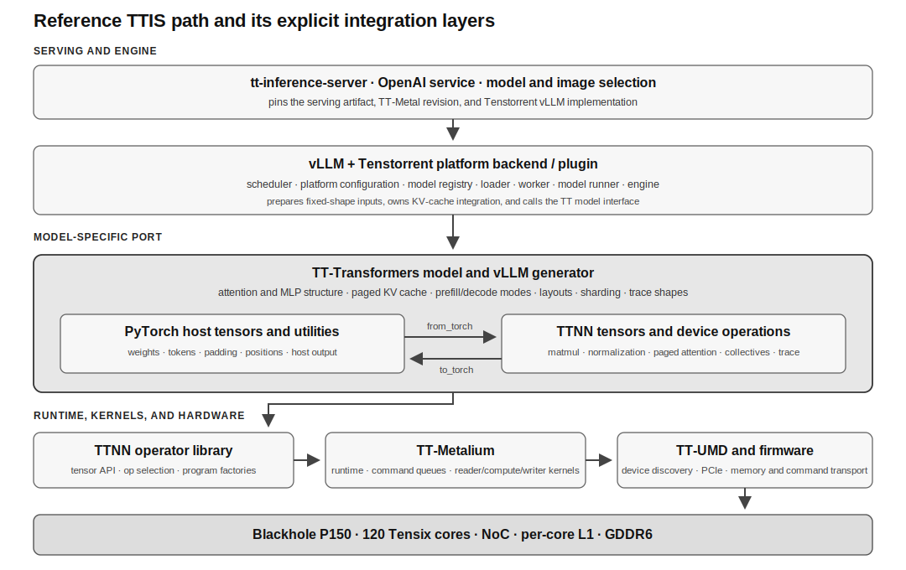
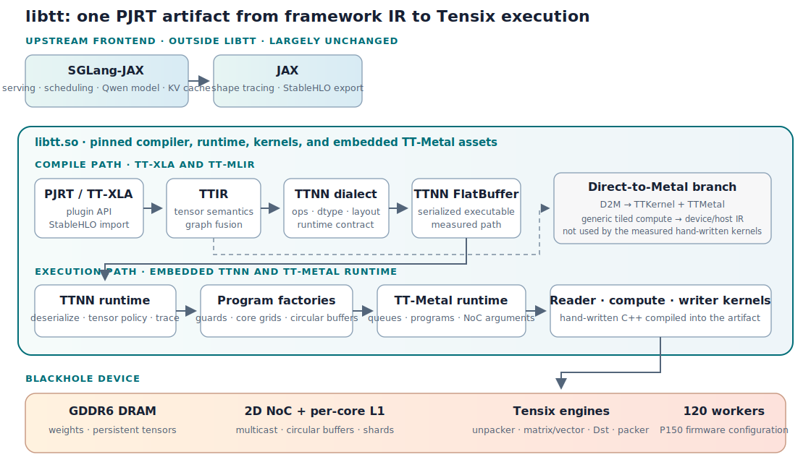
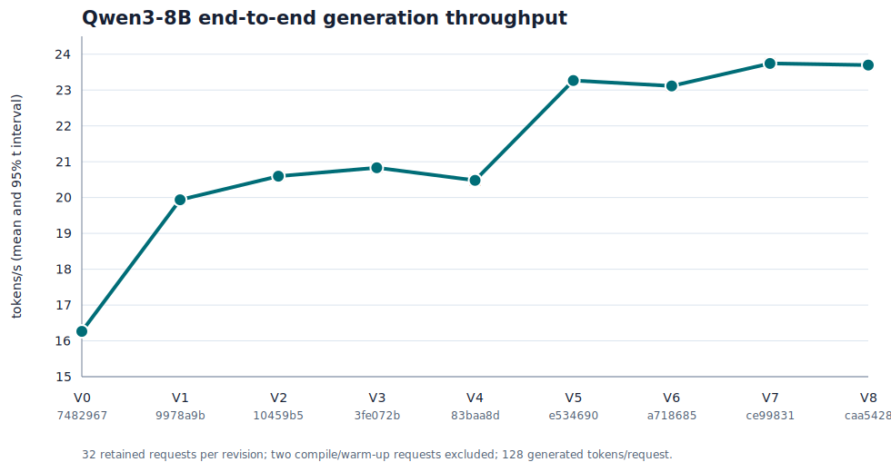
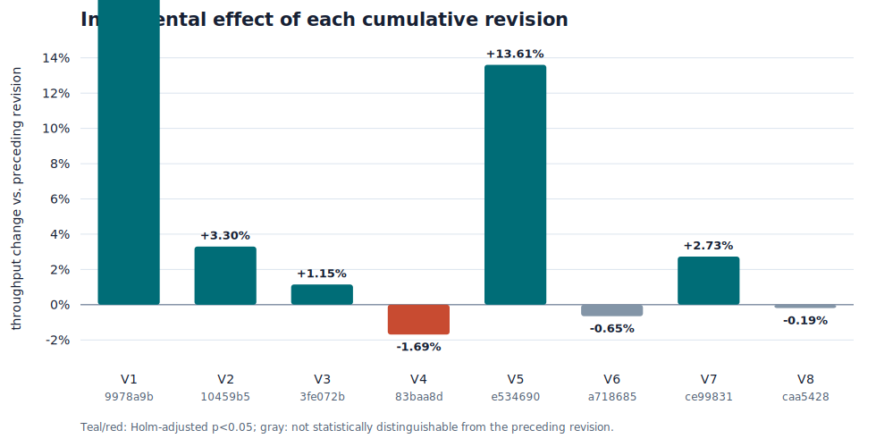
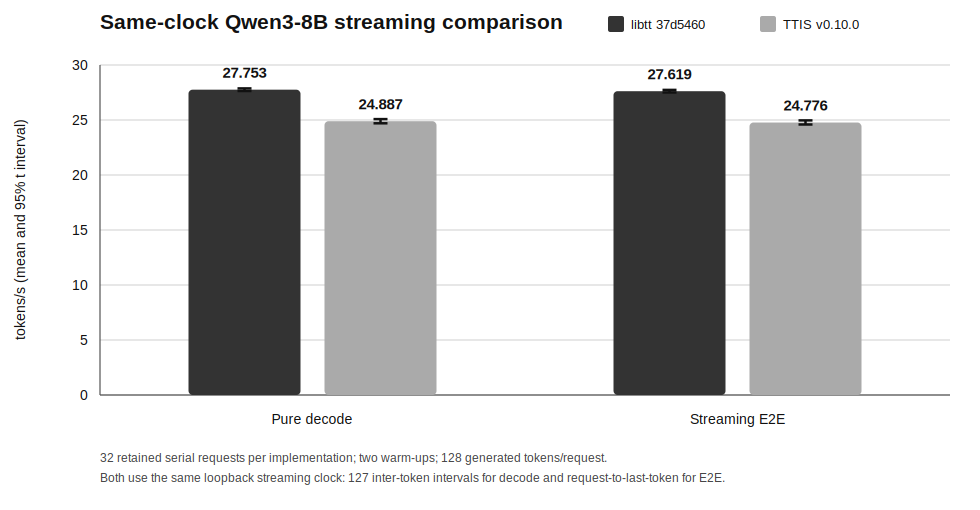

# Abstract {-}

Designing a high-performance tensor accelerator is difficult. Building the
software stack that makes it broadly useful is harder still. Such a stack must
run existing open-source machine-learning systems across models and workloads
while mapping logical tensors onto tiled device memory, topology-aware
communication, and specialized kernels. It must expose enough of the hardware
for optimization without requiring each framework, serving engine, or model to
be ported by hand.
libtt adopts the TPU software boundary for Tenstorrent. StableHLO and PJRT let
it reuse software from the JAX ecosystem above the compiler rather than porting
each framework and model, while MLIR supplies mature infrastructure for
lowering logical tensors onto tiled memory and topology-aware execution. The
same XLA boundary provides an architectural path to PyTorch through TorchTPU.
libtt packages the open-source compiler, runtime, device kernels, and runtime
assets in one shared library. We demonstrate it with upstream SGLang-JAX and
Qwen3-8B. A sequence of graph, layout, runtime, and kernel optimizations raises
measured 128-token end-to-end generation from 16.265 to 27.619 tokens/s, a
69.81% improvement, and delivers 27.753 decode tokens/s, 11.51% faster than the
measured tt-inference-server reference on the same Blackhole P150 and workload.
The result shows that a stable XLA boundary can keep the upper software stack
close to upstream while concentrating hardware-specific performance work in
the compiler and lower runtime.

# Introduction

This report asks whether Tenstorrent accelerators can support programs from the
XLA ecosystem through a standard compiler boundary—without a device-specific
model or serving-engine fork—while retaining hardware-specific performance.
libtt's answer is an open-source, self-contained XLA stack built around PJRT
[6] and StableHLO [7]. It compiles and executes framework programs while
keeping Tenstorrent-specific code below that boundary.
The source code, patches, and build files are available in the public libtt
GitHub repository [35].

The implementation evaluated here uses JAX. Upstream SGLang-JAX retains its
tokenizer, scheduler, Qwen model, and paged KV cache [9], while libtt compiles
and executes the exported StableHLO. JAX is the demonstrated frontend, not the
architectural boundary. Google's announced TorchTPU design captures PyTorch
graphs with Dynamo, translates PyTorch operations to StableHLO, and uses XLA as
its primary backend compiler [2]. This gives libtt a path to support PyTorch as
that interface becomes available. The required adapter and operation coverage
have not yet been implemented or measured.

The XLA boundary has two practical advantages. First, framework and serving
code can remain close to upstream instead of being replaced by a
Tenstorrent-specific model and inference engine. Second, performance work can
reside in TT-MLIR [23], TTNN [26], TT-Metalium [21], and device kernels, where
graph structure, layout, precision, and data movement remain visible. The same
boundary can carry inference or training graphs; this report measures
inference only.

The report makes four contributions. First, it describes a single `libtt.so`
artifact containing the Tenstorrent PJRT backend, compiler, runtime, kernels,
and runtime assets. Second, it demonstrates this XLA boundary with upstream
SGLang-JAX and identifies the future PyTorch/TorchTPU path. Third, it presents
compiler and kernel optimizations that cross StableHLO, TT-MLIR, TTNN, and
TT-Metal without modifying the SGLang scheduler or Qwen model [31]. Finally, it
measures a 69.81% end-to-end improvement from 16.265 to 27.619 tokens/s and
27.753 decode tokens/s, 11.51% above the matched tt-inference-server v0.10.0
reference [20].

The following sections describe the system boundary, compiler and runtime
representations, individual optimizations, and measured effects.

# Tenstorrent hardware and software stack

The performance comparison later in this report involves more than two kernel
libraries. The reference TTIS path includes a serving engine, a
Tenstorrent-specific engine backend, a model-specific implementation, TTNN,
TT-Metalium, the user-mode driver, firmware, and the device. This section
separates those layers and identifies the code required to join them.

## Blackhole and the Tensix execution model

The benchmark uses a Blackhole P150. The Blackhole processor exposed by current
P150 firmware has 120 Tensix cores, 180 MB of SRAM (1.5 MB per core), and up to
32 GB of GDDR6 memory [12]. The host reaches the card over PCIe. Device DRAM is
distinct from host memory, and the SRAM local to a Tensix core is explicitly
managed working storage rather than a hardware cache.

Tensix cores communicate through a two-dimensional network on chip. A typical
TT-Metalium program assigns a reader data-movement kernel, a compute kernel,
and a writer data-movement kernel to each participating core. The three kernels
exchange tiles through circular buffers in local SRAM and can overlap memory
traffic with arithmetic [21, 22]. Matrix and vector results pass through the
unpacker, SrcA/SrcB and Dst registers, and the packer before returning to L1.

These details matter for batch-one decode. The weights are much larger than a
token activation, so every layer repeatedly streams weights from GDDR6. Core
count, NoC multicast, circular-buffer capacity, and the number of times an
intermediate is packed or written to DRAM directly determine token latency.

## Why the TPU software architecture fits Tenstorrent

TPUs and Tenstorrent accelerators have two important things in common. Their
main matrix paths use tiled tensors in device DRAM, and their systems connect
chips with fast direct links. Both features make compiler support central to
performance.

First, the physical layout of a tensor matters across operations. XLA assigns
tiled layouts to TPU buffers and pads shapes that do not fill a tile [8].
Tenstorrent uses 32-by-32 tiles for most Tensix matrix compute and data
movement. Tiled tensors can be stored in DRAM or L1 [18, 27]. The compiler and
runtime must choose the tile layout, padding, memory location, and sharding,
then keep compatible layouts between producers and consumers. If every
operation changes the layout, the extra reads, writes, and conversions can
remove much of the accelerator's benefit.

This makes a compiler a basic part of a fast TPU or Tenstorrent path. It must
plan physical layouts across the graph, not only select an arithmetic kernel.
The optimizations in this report follow that model: StableHLO keeps logical
tensors above the device boundary, while TT-MLIR and TTNN carry the tiled
physical layout below it.

The common GPU path is different. GPU tensors can stay row-major or strided in
global memory. A CUDA kernel can read that array directly and load tiles into
registers or shared memory for its own work [5]. The next kernel can read the
same row-major or strided buffer. It does not first need a persistent tiled
DRAM layout. This is why eager GPU execution can be efficient: each operation
can launch an optimized kernel on the existing data without a layout
conversion before every launch. GPU graph compilers still improve fusion,
launch overhead, and scheduling, but a whole-graph compiler is less central to
the basic execution model.

Second, TPU and Tenstorrent systems both provide fast links between chips. TPU
slices connect chips through high-speed ICI in two- or three-dimensional
topologies [3]. A Blackhole P150 card has four 800 Gbps ports that connect
directly to other Blackhole cards [12]. Tenstorrent Galaxy systems connect
Blackhole chips in grid or torus topologies [34]. These links let the system
act as a mesh of accelerators rather than a set of unrelated PCIe devices.

At this scale, the compiler and runtime must decide how to shard tensors, place
work, and schedule collectives over the chip topology. This report benchmarks
one P150, so it does not measure multi-chip execution. The interconnect still
supports the same long-term software design: graph compilation above a device
mesh with explicit layout, placement, and communication.

\begingroup\small

| Execution path | Device data and links | Software consequence |
|:--|:--|:--|
| XLA on TPU | Tiled buffers in device memory; chips linked by high-speed ICI. | The compiler plans layout, sharding, communication, and execution. |
| libtt on Tenstorrent | The main matrix path uses tiles in DRAM and L1; Blackhole cards have direct high-speed links. | Keep layouts across operations and plan work over the device mesh. |
| Eager GPU path | Row-major or strided buffers can remain in global memory; kernels tile on load. | Optimized kernels can run directly on existing buffers without a graph-wide layout plan. |

\endgroup

This is why the TPU software architecture fits Tenstorrent. Both need software
that starts from a graph, assigns tiled physical layouts, and plans execution
over a connected set of chips. A GPU-style eager interface can also work, but
it leaves more layout and communication decisions to model and operator code.

## Runtime and operator layers

The software stack exposes the device at several levels:

| Layer | Responsibility |
|:--|:--|
| TT-UMD | Discovers devices and provides the user-mode PCIe, memory, and command transport used by higher runtimes [29]. |
| TT-Metalium | Allocates device resources, builds command programs, and compiles and dispatches reader, compute, and writer kernels [21, 22]. |
| TTNN | Provides Python and C++ tensor operations, tensor layouts, memory configurations, sharding, program selection, and tracing on top of TT-Metalium [26]. |
| TT-Transformers | Implements Transformer structure, model configuration, paged attention, KV-cache behavior, prefill/decode paths, and device-specific layouts with TTNN calls [28]. |
| TT vLLM backend and TTIS | Connects model implementations to the serving scheduler, request batching, cache allocation, model loading, and OpenAI-compatible service [15, 20]. |

TTNN is therefore an operator library and direct runtime interface, not a
framework compiler boundary by itself. It exposes preoptimized operations and
selects TT-Metalium programs, but a caller using TTNN directly still constructs
the model, chooses layouts and shapes, manages state, and determines when host
and device tensors cross the boundary.

## How TTIS reaches TTNN

Tenstorrent uses vLLM for scheduling, continuous batching, paged attention,
and the OpenAI-compatible server. Its current integration guide describes a TT
platform backend/plugin and a maintained vLLM fork [15]. The backend supplies
platform configuration, model registration, model loading, worker and device
initialization, KV-cache management, input preparation, execution, and TT
engine behavior. The plugin reduces the amount of code that must live directly
inside a vLLM fork, but these Tenstorrent-specific engine responsibilities
remain.

Adding a model requires more than registering a generic Hugging Face class.
The documented integration contract requires:

1. a TTNN paged-attention implementation using the TT cache-fill, cache-update,
   and paged decode operations;
2. a TT-Transformers generator with initialization, KV-cache allocation,
   prefill, decode, trace warm-up, output, and capability interfaces;
3. fixed-shape padding and trace behavior compatible with the TTNN execution
   path;
4. model registration and configuration in the TT vLLM backend; and
5. for new model types or inputs, possible changes to the platform, loader,
   worker, model runner, or engine [15].

The v0.10.0 artifact measured in this report used TT-Metal source snapshot
`e867533` and Tenstorrent vLLM source snapshot `22be241`. In that release, the TT platform code was
carried in the Tenstorrent vLLM path. Current upstream code is increasingly
packaged as a plugin, but the model-facing interface and TT-specific execution
logic described above remain. We distinguish this packaging change from the
v0.10.0 performance measurement [20].

{#fig:reference-stack width=100%}

## PyTorch and TTNN in the same model implementation

TT-Transformers intentionally uses PyTorch and TTNN in the same Python model.
The Qwen/Llama model source imports both libraries. Host tokens, positions,
padding, checkpoint values, and some output processing use `torch.Tensor`,
while `ttnn.from_torch` creates TTNN tensors for device execution and
`ttnn.to_torch` returns selected outputs to the host [28]. The vLLM generator
similarly accepts PyTorch token and page-table tensors, allocates the paged KV
cache as TTNN tensors, and calls model-specific prefill and decode methods.

This does not mean that the main Transformer matmuls execute in PyTorch on the
CPU. Those operations use TTNN and TT-Metalium. It does mean that the reference
path contains a hand-written, Tenstorrent-specific upper model layer that
decides where the PyTorch/TTNN conversions occur and encodes padding, trace
shapes, cache layout, dtype, sharding, collectives, and model-specific
fast paths. Supporting a new architecture requires extending this model port
and its serving adapter.

## Contrast with the libtt boundary

| Concern | TTIS and TT-Transformers path | libtt path |
|:--|:--|:--|
| Serving engine | vLLM with a TT platform backend/plugin | The measured SGLang-JAX engine remains above PJRT |
| Model | TT-Transformers implements a TT-specific Transformer and generator | The measured upstream JAX Qwen model is exported through XLA to StableHLO |
| Framework/device boundary | Python generator methods and explicit PyTorch/TTNN tensor conversion | XLA's StableHLO and PJRT interfaces |
| Paged KV cache | Coordinated by vLLM backend code and TT-Transformers TTNN operations | Expressed by SGLang-JAX and lowered through TT-XLA/TT-MLIR |
| Performance work | TT-specific engine, model, TTNN, program, and kernel code | TT-MLIR transformations, TTNN runtime policy, and TT-Metalium kernels |
| Deployment | Server images pin compatible TT-Metal and vLLM revisions | One `libtt.so` pins and contains the compiler and runtime stack |

The direct TTNN approach gives the model author explicit control at every
layer. libtt instead preserves a stable compiler boundary and attempts to
recover the same hardware-specific performance below it. The comparison in
this report tests whether that lower-stack approach can keep an XLA frontend
close to upstream without giving up decode performance.

# System organization

{#fig:stack width=100%}

## Deployment and frontend boundary

PJRT lets XLA frontends call device-specific compiler and runtime plugins
through one interface [6]. libtt implements that interface for Tenstorrent:

```{=latex}
\begin{minipage}{\linewidth}
```

```text
XLA frontend process (JAX in the measured path)
  `-- dynamically loads libtt.so through PJRT
       |-- compiles StableHLO for Tenstorrent
       |-- allocates and transfers device buffers
       |-- loads and executes serialized TTNN programs
       `-- initializes the embedded TT-Metal runtime assets
```

```{=latex}
\end{minipage}
```

libtt's C++ glue extracts the embedded archive to a fingerprinted temporary
directory, sets `TT_METAL_RUNTIME_ROOT` before PJRT starts, links the upstream
plugin, and exports only the PJRT entry points. Most code comes from pinned
open-source dependencies and the applied patch series.

Today, libtt is a set of patches on pinned source snapshots of TT-XLA, TT-MLIR, and
TT-Metal/TTNN. The patches cover the build, compiler passes, runtime choices,
and device kernels. Keeping the patches in one repository makes them easy to
compare with upstream code and lets one change span all three projects.

The compiler and TT-Metal runtime do not need to be installed on the target.
With compatible drivers and firmware, `libtt.so` contains the software needed
to compile and run StableHLO programs. This is the intended similarity to
`libtpu.so` [11].

libtt treats PJRT and StableHLO as the integration boundary. In the measured
path, SGLang-JAX keeps its model, tokenizer, scheduler, paged KV cache, and
inference engine. The Tenstorrent-specific work stays below that boundary
instead of requiring a forked Qwen implementation or a rewritten serving
layer. A future PyTorch path can reach the same boundary through TorchTPU once
the backend interface and required operation coverage are available [2].

The SGLang-JAX prototype uses a small TT integration patch. It adds the TT
attention backend, device selection, weight annotations and loading, and
KV-cache support [33]. The scheduler, tokenizer, and Qwen model structure stay
close to upstream. Most of the JAX software does not change. It only needs a
small device integration layer, not a new framework, serving engine, or
Transformer implementation.

This provides two advantages:

- XLA frontend code can stay upstream, as demonstrated here with SGLang-JAX;
  and
- performance can be added in TT-MLIR, TTNN, TT-Metal, and device kernels,
  where layout, fusion, precision, and data movement are visible.

We evaluate inference, but PJRT and StableHLO are neither framework- nor
inference-specific. JAX or PyTorch training support can use the same boundary
after the required operations, collective behavior, optimizer graphs, and
numerical validation are available.

## Integrated build

libtt uses one Bazel build for the whole stack. Bazel pins TT-UMD [29], SFPI
[17], TT-Metal, LLVM, StableHLO, TT-XLA [30], TT-MLIR, Shardy [36], and
supporting C++ libraries [1]. It applies the libtt patches and adds build
targets where needed. The `//:tt` target builds the compiler, runtime, kernels,
and runtime assets, then links them into `bazel-bin/libtt.so`.

This organization has three practical effects:

- Source revisions, overlays, patches, toolchains, and link rules are inputs to
  one build.
- Compiler, schema, runtime, program-factory, and kernel changes can be tested
  together.
- An agent can inspect and edit every layer in one workspace, rebuild one
  target, and run one benchmark.

Tenstorrent's compiler overview describes the same open path from framework
frontends through TT-MLIR dialects to TT-Metalium [19, 24]. libtt builds a
pinned part of that path as one artifact.

## Cross-layer optimization

The matmul-SwiGLU epilogue is an example of a cross-cutting optimization. It
cannot be implemented only as a graph rewrite or only as a device kernel. It
needs coordinated changes across six layers:

1. A graph pass must prove that a paired gate/up matmul feeds the exact
   `silu(gate) * up` expression.
2. TTNN IR needs an operation-level representation that preserves the fused
   semantic through lowering.
3. The serialized executable needs to carry the new matmul attribute.
4. The runtime must dispatch that operation into TTNN.
5. TTNN must select a program factory only for supported shapes, dtypes,
   layouts, and hardware.
6. Reader, compute, and writer kernels must keep the paired tiles resident in
   Dst and emit only the half-width final result.

The full stack is open source, so libtt can change all of these layers and test
them together in one build. This is what makes cross-cutting optimizations such
as matmul-SwiGLU practical. The six changes form one patch concept even though
they touch several abstraction levels and two upstream repositories.

## TT-MLIR IR levels

MLIR supports dialects at different abstraction levels [4]. TT-MLIR uses them
for model semantics, layouts, tiled computation, device kernels, and host/device
control [24]. Each optimization should use the highest level that still has
the information it needs.

Table: The TT-MLIR IR ladder and where libtt's measured path uses it.

| Representation | Abstraction and purpose | Relationship to current libtt optimizations |
|:--|:--|:--|
| StableHLO | Framework-portable tensor graph with specified operation semantics [7]. | Input to TT-XLA/TT-MLIR. Framework algebra such as expanded SiLU is visible here and after import, but libtt's patches generally match it in TTIR/TTNN passes. |
| TTIR | Hardware-aware, high-level tensor IR. It preserves named tensor operations while permitting fusion and canonicalization before a concrete runtime API is chosen [24]. | JAX RMSNorm recognition, expanded-SiLU recovery, shared-LHS matmul grouping, role propagation, and part of QKV/RoPE fusion. |
| TTNN dialect | High-level tensor IR designed to model the TTNN library closely. Its types and attributes carry tiled layouts, memory spaces, sharding, and device data types [24, 25]. | QKV composite fusion, `matmul_swiglu`, layout selection, cache return types, and lowering to the serialized TTNN operation graph. |
| TTNN FlatBuffer | Serialized executable operation graph consumed by the TTNN runtime. It is an artifact rather than an MLIR dialect. | Carries operation parameters such as the fused-SwiGLU matmul flag across the compiler/runtime boundary. |
| D2M dialect | Generic tensor/memref computation analogous to `linalg.generic`, augmented with grids, sharded tensors, circular buffers, and explicit data movement [24]. | An alternative direct-to-metal route. The measured custom SwiGLU and down-projection kernels are hand-written TT-Metal/TTNN patches, so they do not pass through D2M. |
| TTKernel dialect | Low-level device-kernel IR exposing circular buffers, tile registers, NoC transactions, and synchronization with an intended near one-to-one mapping to TT-Metal kernels [24]. | Relevant to generated direct-to-metal kernels; not the representation of the hand-written C++ kernels measured here. |
| TTMetal dialect | Host/device interop IR for allocation, transfers, program creation, and enqueue operations [24]. | Part of the direct-to-metal compiler route. The measured TTNN route instead invokes TT-Metal host APIs from the TTNN runtime. |

The main lowering branch in this report is therefore:

```text
StableHLO → TTIR → TTNN dialect → TTNN FlatBuffer
                                      ↓
                              TTNN C++ runtime
                                      ↓
                       TT-Metal host + C++ kernels
```

TT-MLIR also supports the lower-level branch:

```text
TTIR → D2M → TTKernel + TTMetal → generated device/host program
```

Only the first branch runs the benchmarked patches. Their hand-written C++
program factories and kernels are not TTKernel IR optimizations.

## TTNN runtime and the serialized executable

TTNN IR models operations such as matmul, RMSNorm, SDPA, and reshape. Lowering
serializes them into a FlatBuffer. The runtime deserializes the graph, creates
tensors, sets memory configurations, validates each operation, and selects a
program factory. The RMSNorm patch uses the concrete input shape here to choose
a 16-core width-sharded layout; the compiler still emits a normal RMSNorm.

## TT-Metal programs and Tensix kernels

TT-Metalium uses cooperative dataflow rather than a GPU thread hierarchy [22].
A program usually has:

- a reader data-movement kernel to fetch tiles from DRAM or another core into
  L1 circular buffers;
- a compute kernel to unpack tiles, drive matrix/vector engines, and create
  result tiles; and
- a writer data-movement kernel to drain result buffers to their destination.

Circular buffers are bounded queues shared by the threads of a Tensix core
[13]. Reader, compute, and writer kernels can overlap on different tiles when
their buffer and semaphore protocols are correct.

The compute engine exposes SrcA, SrcB, and Dst register sets. Matrix results
land in Dst; vector operations can transform them; the packer writes them to an
L1 circular buffer [14]. With 16-bit Dst storage and double buffering enabled,
the active half contains eight 32-by-32 tiles. That capacity determines the
successful SwiGLU geometry: four gate and four up tiles fill Dst exactly.

## Tiles, memory, and low-precision weights

TTNN's standard tile is 32 by 32 elements with four 16-by-16 faces [18]. Final
dimensions are padded, so batch-one decode still presents a full tile row.
Kernels must account for both the logical and padded shapes.

Large weights reside in device DRAM; L1 is smaller, faster, and private to each
worker. TTNN `MemoryConfig` values describe interleaved or sharded storage and
DRAM or L1 placement. TT-MLIR layout attributes similarly encode how a logical
tensor maps to devices, cores, physical shards, memory space, and padding [25].

We use BF16 activations and outputs with BFLOAT8_B weights.
BFLOAT8_B is block floating point: 16 values share an exponent [27]. It reduces
the dominant weight traffic in batch-one decode, with a precision and packing
trade-off. The custom matmuls use BF16 packer-L1 accumulation: partial sums are
packed into an L1 slot and reloaded for later K blocks, leaving Dst available
for the current block's tile group.

## Decode bottlenecks

Qwen3 is a decoder-only Transformer family [31]. A simplified layer is:

$$
\begin{aligned}
u &= \operatorname{RMSNorm}(h),\\
h' &= h + \operatorname{Attention}(Q(u),K(u),V(u);K_{cache},V_{cache}),\\
v &= \operatorname{RMSNorm}(h'),\\
g &= vW_{gate}, \qquad r = vW_{up},\\
h_{next} &= h' + \bigl(\operatorname{SiLU}(g)\odot r\bigr)W_{down}.
\end{aligned}
$$

RMSNorm and SwiGLU are standard model concepts [10, 32]. Prefill shares each
weight read across many rows. Serial decode applies a logical $1\times K$ by
$K\times N$ projection for every token, so weight traffic and intermediate
materialization dominate. The main optimizations add width parallelism, reduce
DRAM traffic, or avoid packing an intermediate from Dst.

# Optimization of the model path

Each subsection below describes one implemented feature, the layer where it is
implemented, and its measured effect.

\begingroup\footnotesize

Table: Implemented model-path features, implementation levels, and measured effects.

| Feature | Principal level / IR | Measured effect |
|:--|:--|--:|
| Recover JAX RMSNorm | TTIR graph rewrite | +19.28% marginal effect |
| Lower SiLU calls | StableHLO-to-TTIR rewrite | No positive decode effect detected |
| Recognize expanded SiLU | TTIR graph rewrite | +3.30% |
| Fuse rank-3 decode RoPE | TTIR/TTNN composite resolution | +2.89% marginal effect |
| Fuse Qwen decode QKV structure | TTIR ordering + TTNN fusion | +1.15% |
| Preserve KV-cache result types | TTNN type inference | +0.54% marginal; near measured drift |
| Enable BF8 activation lowering | Compile options and TTNN lowering | +0.26% marginal; near measured drift |
| Pack BF8 host weights directly | TTNN host conversion | Model preparation only; not measured |
| Permit decode layouts | TTNN/TT-Metal validation | No positive decode effect detected |
| Width-shard decode RMSNorm | TTNN runtime policy | +13.61% |
| Combine two shared-LHS matmuls | TTIR fusion | -1.69%; enables epilogue |
| Fuse SiLU into the following multiply | TTNN operation fusion | -0.65% |
| True matmul-SwiGLU epilogue | TTNN IR/FlatBuffer/runtime + TT-Metal | +2.73% |
| Generalize and remove fallback | TTNN matching/runtime simplification | -0.19% |
| Sweep SwiGLU K blocking | TT-Metal program and CB geometry | +0.27% |
| Specialize down projection | TTNN program selection + TT-Metal | +5.96% pure decode |
| Trace one-tile prefill | TTNN/TT-Metal runtime trace | -90.44% TTFT; +10.23% E2E |

\endgroup

The initial features were also measured in a separate leave-one-feature-out
experiment. The functional baseline averages 16.039 tokens/s and the complete
set averages 19.894 tokens/s, a +24.03% gain. Baseline and complete-set results
each contain 64 retained requests; each omission contains 32. The marginal
effects interact and therefore do not add to the total.

## RMSNorm recognition

JAX can lower RMSNorm to square, reduce, epsilon addition, reciprocal square
root, scaling, and reshapes. The [RMSNorm recognition
patch](../../third_party/tt_xla/tt_mlir_fuse_jax_rms_norm.patch) proves this
structure and replaces it with one TTIR RMSNorm operation while the algebra and
use-def graph are still available. TTNN can then apply its normalization and
layout logic. This recognition also enables runtime width sharding.

**Measured effect.** Removing RMSNorm recognition from the otherwise complete
feature set lowers throughput from 19.894 to 16.678 tokens/s. Restoring it gives
a +19.28% marginal speedup and accounts for 83.4% of the measured initial gain.
The omitted build remains deterministic but produces a different token
sequence, so this test does not establish equal model quality.

## SiLU call lowering

Some JAX graphs contain a function call named `silu`. The SiLU call-lowering
feature replaces that call with a TTIR SiLU operation during StableHLO
legalization.

**Measured effect.** Removing the rewrite changes throughput by +0.45%, so
this graph shows no positive decode effect. The feature remains useful for
graph coverage.

## Expanded-SiLU recognition

The graph represents

$$
\operatorname{SiLU}(x)=x\,\sigma(x)=\frac{x}{1+\exp(-x)}
$$

with casts, broadcasts, reshapes, and a splatted scalar one. The [expanded-SiLU
patch](../../third_party/tt_xla/tt_mlir_fuse_expanded_silu.patch) looks through
view-like operations, verifies the constant and shared input, and replaces the
tree with SiLU.

**Measured effect.** End-to-end throughput improves by +3.30%.

## Rank-3 decode RoPE

Qwen applies rotary position embedding after reshaping Q and K by head count.
The [rank-3 RoPE
patch](../../third_party/tt_xla/tt_mlir_fuse_rank3_rope_decode.patch) accepts
JAX's rank-3 decode form, temporarily maps it to the existing rank-4 composite,
and restores the expected result shape. TTIR identifies the pattern, while
TTNN owns the composite operation and runtime contract.

**Measured effect.** Omitting the fusion lowers throughput by 2.81%; restoring
it gives a +2.89% marginal speedup and accounts for 14.5% of the measured
initial gain.

## QKV projection structure

Qwen projects Q, K, and V together and applies per-head RMSNorm to Q and K. The
[QKV projection
patch](../../third_party/tt_xla/tt_mlir_qwen_decode_qkv_projection_fusion.patch)
orders projection roles, validates contiguous Q/K/V bounds, head counts, and
head dimensions, and replaces materialized slices and reshapes with
`nlp_create_qkv_heads_decode`. Q and K RMSNorm are recreated on the fused
rank-4 results.

**Measured effect.** End-to-end throughput improves by +1.15%.

## KV-cache dtype and role propagation

KV-cache update operations are stateful boundaries. Their return types must
carry the selected device dtype, and graph-role metadata must survive unary
operations so later fusions can still identify query, key, and value paths. The
[KV-cache typing
patch](../../third_party/tt_xla/tt_mlir_kv_cache_dtype_return_types.patch)
preserves result types across cache updates. TT-XLA role propagation keeps
later query, key, and value paths recognizable.

**Measured effect.** Removing KV-cache result typing lowers throughput by
0.54%; restoring it gives a +0.54% marginal speedup. This change is close to
the observed sequential drift.

## BF8 activation lowering

We request `bfp_bf8` for eligible weights. BF8 weight storage and host packing
already exist in the functional baseline. The new feature enables activation
lowering on one chip through the [TT-XLA dtype
patch](../../third_party/tt_xla/tt_xla_enable_bf8_activation_dtype_lowering.patch)
and [TT-MLIR dtype
patch](../../third_party/tt_xla/tt_mlir_single_chip_activation_dtype_lowering.patch).
TTNN and TT-Metal then consume the selected BFLOAT8_B tiles.

**Measured effect.** Removing both activation-lowering changes reduces
throughput by 0.25%; restoring them gives a +0.26% marginal speedup. This
change is close to the observed sequential drift.

## Fast BF8 host packing

The [fast BF8 packing
patch](../../third_party/tt_metal/fast_bfloat16_bfp8_pack.patch) accelerates
conversion of BF16 host weights to 32-by-32 BFP8 tiles. This reduces model
preparation time but does not change the steady-state decode graph.

**Measured effect.** Decode throughput is not affected; model-load time was
not measured in this report.

## Width-sharded decode RMSNorm

The default logical height of RMSNorm during batch-one decode is one. A generic
height-parallel program cannot occupy many cores. At run time, we recognize a
device-resident, tiled, unsharded input with sequence length one and width at
least 2048. When the width divides into 16 tile-aligned shards, it:

1. creates an 8-by-2 row-major core grid;
2. width-shards the tensor into the cores' L1 memories;
3. derives the layernorm program configuration from that shard specification;
4. executes sharded RMSNorm; and
5. restores the requested output memory configuration.

The two conversions cost less than the width-parallel reduction saves. This is
runtime policy, not a new IR operation: the compiler identifies RMSNorm, while
the runtime knows the tensor and device geometry.

**Measured effect.** End-to-end throughput improves by +13.61%.

## Decode layout admission

Two TT-Metal changes admit layouts selected by the optimized graph:

- The [SDPA layout
  patch](../../third_party/tt_metal/sdpa_decode_allow_l1_interleaved_q.patch)
  allows SDPA decode to consume an L1-interleaved query.
- The [layernorm layout
  patch](../../third_party/tt_metal/layernorm_allow_single_core_height_sharded.patch)
  allows the single-core height-sharded layout produced on the decode path.

These narrow changes keep shape and layout checks while admitting layouts used
by other optimized paths.

**Measured effect.** Removing both changes increases throughput by 0.66%, so
the measured graph shows no positive decode effect. Their role is layout
coverage.

Across this initial feature set, the marginal throughput losses account for
96.3% of the baseline-to-complete-set difference. The remainder comes from
feature interactions and sequential drift. The individual percentages should
therefore not be added as if they were independent.

## Shared-LHS gate/up projection

Qwen's two first MLP projections share an activation:

$$
xW_{gate},\;xW_{up}
\quad\longrightarrow\quad
x[W_{gate}\;W_{up}].
$$

The [shared-LHS
patch](../../third_party/tt_xla/tt_mlir_fuse_shared_lhs_matmul_pairs.patch)
changes TTIR fusion eligibility so a pair can be combined. This removes
duplicate activation reads and launches, but writes a doubled-width output that
SwiGLU slices and rereads. Throughput falls because the representation still
materializes too much data. It becomes useful when the epilogue consumes it
directly.

**Measured effect.** End-to-end throughput changes by -1.69%.

## Consumer-side SiLU fusion

An intermediate experiment placed SiLU as a unary activation on the following
TTNN multiply. That removes one elementwise operation but retains the expensive
boundary:

```text
combined matmul → pack full gate/up tensor → memory
                → read/unpack → SiLU + multiply → pack result
```

Removing an operation does not help when the same large intermediate is still
written and read.

**Measured effect.** End-to-end throughput changes by -0.65%.

## Dst-resident matmul-SwiGLU epilogue

Two patches implement the producer-side epilogue:

- The [compiler and runtime
  patch](../../third_party/tt_xla/tt_mlir_fuse_matmul_swiglu.patch) recognizes
  the TTNN graph, introduces the fused matmul semantic, extends the FlatBuffer
  representation, serializes it, and invokes the corresponding runtime path.
- The [TT-Metal epilogue
  patch](../../third_party/tt_metal/matmul_swiglu_epilogue.patch) adds TTNN
  validation, a program factory, and the TT-Metal
  reader/receiver/sender/compute kernels.

The contract supports one physical tile row, BF16
activation/output, BFLOAT8_B weights, DRAM-interleaved tensors, no transpose or
bias, and a grid that can supply 96 workers. For Qwen3-8B, each worker owns four
gate tiles and four corresponding up tiles—exactly the eight active 16-bit Dst
slots.

The program performs the following sequence:

1. two sender cores multicast activation K blocks over the NoC;
2. each of 96 workers reads its paired gate/up weight tiles;
3. the matrix engine accumulates all eight output tiles;
4. partial K results use BF16 packer-L1 accumulation;
5. final gate/up partials are loaded together into Dst;
6. SiLU transforms Dst slots 0–3;
7. each gate tile multiplies its corresponding up tile in place; and
8. only four final BF16 tiles are packed and written.

The doubled-width gate/up tensor is never materialized.

**Measured effect.** End-to-end throughput improves by +2.73%.

## Prefill coverage and fallback removal

We then generalized the matcher from decode-specific naming to any supported
one-tile-row input, which includes short prefill. The older consumer-side
SiLU-multiply fallback was removed; validation remains at the TTNN/TT-Metal
boundary, where unsupported dtype, layout, shape, and hardware combinations
fail explicitly.

The change removes code and adds prefill coverage without changing the fast
kernel or completion hash.

**Measured effect.** End-to-end throughput changes by -0.19%.

## SwiGLU K-blocking sweep

The initial epilogue uses `in0_block_w = 2`. Every two K tiles it packs eight
partial tiles into L1 and later reloads them. Larger blocks reduce partial
traffic but need larger activation and weight circular buffers.

The [TT-Metal epilogue
patch](../../third_party/tt_metal/matmul_swiglu_epilogue.patch) exposes
`TT_METAL_SWIGLU_IN0_BLOCK_W={2,4,8,16}` and sizes the circular buffers from the
chosen value. The 32-sample test compares width 4 with width 2 while disabling
the new down-projection specialization:

| K block | Pure decode mean ± SD | 95% CI | Change |
|--:|--:|:--:|--:|
| 2 tiles | 26.122 ± 0.402 tok/s | [25.977, 26.267] | — |
| 4 tiles | 26.192 ± 0.338 tok/s | [26.071, 26.314] | +0.27% |

The intervals overlap and the measured change is small, so width two remains
the default. Widths 8 and 16 remain available for experiments. Wider blocks
also change accumulation order and can change greedy token sequences.

**Measured effect.** Pure decode throughput changes by +0.27% for four-tile
blocks relative to two-tile blocks.

## 110-core fused-residual down projection

The second MLP matmul has the exact decode shape
$1\times12288$ by $12288\times4096$. The generic program used 64 cores and
achieved only 246.2 GB/s of effective BFP8 weight bandwidth, well below the
SwiGLU kernel. The [down-projection
patch](../../third_party/tt_metal/down_projection_110_core.patch) adds an
exact-shape Blackhole program selected only for BF16 activation/output,
BFLOAT8_B weights, a BF16 residual, DRAM-interleaved tensors, and an 11-by-10
worker grid.

The program avoids a K split and cross-core reduction. It partitions the 128
output tile columns across 110 workers:

- 18 wide workers each compute two N tiles, covering columns 0–35;
- 92 narrow workers each compute one N tile, covering columns 36–127;
- one activation sender multicasts to the other 109 workers;
- weights are read exactly once;
- K is processed four tiles at a time with packer-L1 accumulation; and
- the residual addition occurs in the final compute kernel before output.

Wide and narrow workers need different partial-result circular buffers. An
early implementation gave narrow workers a two-tile ring even though they produced one
tile. Partial sums alternated slots and corrupted output. Separate one- and
two-tile rings fixed the bug.

The exact-shape specialization is enabled by default.
`TT_METAL_DOWN_PROJECTION_110_CORES=0` selects the generic program in the same
binary for A/B measurement.

**Measured effect.** Pure decode throughput improves by +5.96%, from 26.192 to
27.753 tokens/s. Streaming end-to-end throughput improves by +5.88%.

## Runtime trace capture for short prefill

Decode replays a recorded TT-Metal command sequence while refreshing
request-dependent buffers. Previously, the five-token prompt, padded to one
32-row tile, ran as separate host submissions.

Setting `SGLANG_TT_TRACE_DECODE_ONLY=false` records the fixed-shape prefill
sequence too. In a same-binary 32-sample A/B test:

| Metric | Decode-only trace | Prefill + decode trace | Change |
|:--|--:|--:|--:|
| Time to first token | 618.84 ± 4.76 ms | 59.15 ± 3.70 ms | -90.44% (10.46x) |
| Total streaming time | 5.5067 ± 0.0598 s | 4.9299 ± 0.0680 s | -10.48% |
| Pure decode throughput | 25.986 ± 0.315 tok/s | 26.079 ± 0.362 tok/s | +0.36% |

**Measured effect.** Tracing removes about 560 ms before the first token,
reducing TTFT by 90.44%. Pure decode changes by +0.36%, while 128-token
end-to-end throughput improves by +10.23%.

## Packaging, build, and startup changes

Other patches make the single-library deployment buildable and keep startup
cost manageable. They are not decode optimizations.

\begingroup\small

Table: Non-model patch groups in the current libtt build.

| Concept | Representative files | Purpose |
|:--|:--|:--|
| Embedded runtime assets | `tt_metal_runtime_root.cc`, `tt_metal_runtime_auto_setup.cc`, Bazel embed rules | Compress TT-Metal runtime files into `libtt.so`, extract to a fingerprinted temporary root, and initialize before PJRT. |
| Static integration and symbol hygiene | `BUILD.bazel`, `libtt_pjrt_exports.lds` | Link the upstream plugin and internal libraries into one shared object while exposing only PJRT ABI symbols. |
| Bazel overlays | `third_party/*/BUILD.overlay.bazel`, `tt_xla.BUILD.bazel`, `tt_mlir.BUILD.bazel` | Bring separately built upstream projects into one central graph with pinned sources and toolchains. |
| Remove unused fabric/runtime surfaces | `disable_fabric_*.patch`, `disable_inspector_runtime.patch` | Exclude components unnecessary for the single-chip libtt artifact and avoid unresolved or duplicated runtime dependencies. |
| Linkability and TLS constraints | `reduce_static_tls.patch`, `remove_initial_exec_tls.patch`, public-UMD include patch | Make large statically integrated components safe to load as a PJRT shared library. |
| Compiler/runtime trimming | TTNN-only registration/runtime patches, cold stubs, disabled TT-Lang resolver, fast sharded-module check | Avoid bringing unused compiler/runtime paths into the artifact and reduce cold compilation work. |
| API compatibility | protobuf, Shardy, affine, constructor-name, map/include patches | Reconcile pinned source snapshots inside one build without relying on a preinstalled matching stack. |

\endgroup

These patches keep the integrated build loadable and remove unused subsystems.

# Experimental method

## Hardware and software

| Item | Value |
|:--|:--|
| Accelerator | Tenstorrent Blackhole P150 |
| Firmware observed at startup | 19.6.0 |
| Host CPU | Intel Core Ultra 9 185H, 22 logical CPUs online |
| Host OS/kernel | Linux 6.8.0-124-generic, x86-64 |
| Model | `Qwen/Qwen3-8B` |
| Model/activation dtype | BF16 |
| Weight-lowering request | `bfp_bf8` |
| Attention backend | TT |
| Serving frontend | `/home/pcmoritz/sglang-jax` |
| Benchmark date | 15--16 July 2026, America/Los_Angeles |

The P150 exposes 120 Tensix workers in this firmware configuration [12]. The
SwiGLU program uses 96; the new down projection uses 110. Results are
single-device and shape-specific.

## Serving command

We launch the server with the command documented in the repository README:

```bash
env -u TT_METAL_RUNTIME_ROOT \
  PYTHONPATH=/home/pcmoritz/sglang-jax/python \
  PJRT_NAMES_AND_LIBRARY_PATHS=tt:/home/pcmoritz/libtt/bazel-bin/libtt.so \
  JAX_PLATFORMS=tt \
  JAX_USE_SHARDY_PARTITIONER=false \
  JAX_COMPILATION_CACHE_DIR=/tmp/sglang-jax-qwen3-8b-jax-cache \
  SGLANG_TT_HOST_WEIGHT_LOAD=1 \
  SGLANG_TT_OPTIMIZATION_LEVEL=1 \
  SGLANG_TT_EXPERIMENTAL_WEIGHT_DTYPE=bfp_bf8 \
  SGLANG_TT_TRACE_DECODE_ONLY=false \
  /home/pcmoritz/sglang-jax/.venv/bin/python -m sgl_jax.launch_server \
  --model-path Qwen/Qwen3-8B \
  --host 127.0.0.1 --port 31000 \
  --device tt --dtype bfloat16 --attention-backend tt \
  --max-running-requests 2 --max-total-tokens 1024 \
  --max-prefill-tokens 256 --chunked-prefill-size 256 \
  --page-size 32 --watchdog-timeout 1200 \
  --disable-precompile --skip-server-warmup \
  --disable-overlap-schedule --disable-radix-cache
```

Requests are serial despite the capacity of two. Radix caching and overlap
scheduling are disabled so every request executes the same prompt prefill and
does not overlap another request. Optional CPU/fused sampling paths remain at
their disabled defaults; this report concerns the main model path.

The leave-one-feature-out measurements use the same command with
`SGLANG_TT_TRACE_DECODE_ONLY=true` to exclude the later prefill-trace feature.
The baseline and complete feature set each use two 32-request windows. Every
feature omission uses one 32-request window.

## Request and sample policy

We send the same request 34 times in the primary sequence:

```json
{
  "text": "The capital of France is",
  "sampling_params": {"temperature": 0, "max_new_tokens": 128}
}
```

The first two requests are discarded because they include graph compilation,
TT-Metal kernel compilation, trace setup, and cache population. The next 32
complete requests form the analysis window. Primary throughput is

$$T_j=\frac{128}{L_j},$$

where $L_j$ is SGLang's server-reported end-to-end latency.

For the current kernel experiment, we use the streaming completions endpoint
and 32 retained requests per configuration. Pure decode throughput is 127 inter-token
intervals divided by the elapsed time from first to last token. Streaming
end-to-end throughput is 128 divided by loopback-client total time. The exact
per-request observations are in `data/current-kernel-samples.csv`.

## Performance quantities and statistics

For a kernel that appears once in each of the 36 decoder layers, the projected
change in token latency is

$$
\Delta C = 36\left(t_{old}-t_{new}\right).
$$

For the down projection, the measured per-layer difference predicts a
2.241-ms/token reduction; the streaming measurement gives 2.147 ms/token. We
compute effective weight bandwidth as $B_{eff}=S_W/t_k$, where $S_W$ is the
packed BFP8 weight size and $t_k$ is device kernel time. These quantities let
us compare a kernel profile with the end-to-end result without treating the
kernel speedup as the model speedup.

Tables report the mean, sample standard deviation, and two-sided 95% Student-t
interval. These describe variation within each recorded window but do not
remove sequential drift, autocorrelation, or model and shape dependence.

# Results

## Cumulative end-to-end performance

The cumulative measurement starts with upstream SGLang-JAX running on the
functional backend. Each following row adds the named compiler, runtime, or
kernel feature below the XLA/PJRT boundary.

\begingroup\small

Table: End-to-end 128-token generation, 32 retained requests per configuration.

| Optimization set | Mean ± SD (tok/s) | 95% CI | Incremental | vs. baseline |
|:--|--:|:--:|--:|--:|
| Functional baseline | 16.265 ± 0.128 | [16.218, 16.311] | — | 0.00% |
| Complete initial feature set | 19.938 ± 0.283 | [19.836, 20.040] | +22.58% | +22.58% |
| Expanded-SiLU recognition | 20.596 ± 0.279 | [20.495, 20.696] | +3.30% | +26.63% |
| QKV projection fusion | 20.832 ± 0.293 | [20.726, 20.938] | +1.15% | +28.08% |
| Two-way shared-LHS matmul | 20.479 ± 0.321 | [20.363, 20.594] | -1.69% | +25.91% |
| Decode RMSNorm width sharding | 23.265 ± 0.235 | [23.181, 23.350] | +13.61% | +43.04% |
| Consumer-side SiLU/multiply fusion | 23.113 ± 0.296 | [23.007, 23.220] | -0.65% | +42.11% |
| Dst-resident matmul-SwiGLU epilogue | 23.744 ± 0.311 | [23.632, 23.856] | +2.73% | +45.98% |
| Generalized fallback-free epilogue | 23.698 ± 0.274 | [23.599, 23.797] | -0.19% | +45.70% |
| Fixed-shape prefill trace | 26.123 ± 0.394 | [25.981, 26.265] | +10.23% | +60.61% |
| SwiGLU blocking and down projection | 27.619 ± 0.322 | [27.503, 27.735] | +5.73% | +69.81% |

\endgroup

{#fig:throughput width=100%}

{#fig:incremental width=100%}

The negative and near-zero rows explain the final design: shared-LHS fusion
materializes too much data, consumer-side SiLU leaves the producer boundary,
and fallback removal changes coverage rather than the kernel.

All configurations through fixed-shape prefill tracing use the server-reported
request latency from the README benchmark. The final MLP-kernel configuration
uses the loopback streaming end-to-end clock needed for the kernel A/B and
external-server comparison. The clocks cover the same request but were
collected independently, so the final cumulative value is not the isolated
kernel effect.

## MLP kernel measurements

The same-build measurements below separate SwiGLU blocking from the
fused-residual down projection.

Table: Current-branch streaming results, 32 retained samples per configuration. Width 4 is compared with width 2; the down projection is compared with the same width-4 binary/configuration with the specialization disabled.

| Configuration | Pure decode mean ± SD | 95% CI | Streaming E2E mean ± SD | Change in decode |
|:--|--:|:--:|--:|--:|
| SwiGLU K block 2, generic down | 26.122 ± 0.402 | [25.977, 26.267] | 26.016 ± 0.396 | — |
| SwiGLU K block 4, generic down | 26.192 ± 0.338 | [26.071, 26.314] | 26.085 ± 0.333 | +0.27% |
| K block 4, 110-core down | 27.753 ± 0.330 | [27.634, 27.872] | 27.619 ± 0.322 | +5.96% |

The down projection cuts mean decode time from 38.179 to 36.032 ms/token, a
2.147 ms/token saving. Streaming end-to-end throughput rises by 5.88%, from
26.085 to 27.619 tokens/s. TTFT remains about 58 ms.

## Device profile of the down projection

The direct TT-Metal profile identifies 36 occurrences per token, matching the
36 Qwen3-8B decoder layers. Exactly those operation positions change from 64
to 110 workers.

| Metric | Generic program | 110-core specialization | Change |
|:--|--:|--:|--:|
| Workers | 64 | 110 | +71.9% |
| Mean kernel time/layer | 217.188 µs | 154.932 µs | -28.66% |
| Effective BFP8 weight bandwidth | 246.2 GB/s | 345.2 GB/s | +40.18% |
| Projected 36-layer saving | — | 2.241 ms/token | — |

The projected kernel saving is close to the observed 2.147 ms/token. The new
program reaches about 92% of the previously measured 375.1 GB/s SwiGLU
effective bandwidth. This agreement between operation profile and end-to-end
measurement supports the causal attribution.

## Upstream tt-inference-server reference

Tenstorrent's tt-inference-server is an OpenAI-compatible service built around
vLLM and TT-Transformers [20]. It enters the stack above TTNN rather than through
the XLA, StableHLO, and TT-MLIR path:

```text
libtt:  SGLang-JAX → JAX/XLA → StableHLO/PJRT → TT-XLA/TT-MLIR → TTNN → TT-Metal
TTIS:   OpenAI API → vLLM → TT-Transformers                    → TTNN → TT-Metal
```

The two stacks use different porting strategies. TTIS uses TT-specific code in
the inference engine, transformer implementation, TTNN, and TT-Metal. libtt
keeps the measured SGLang-JAX frontend and JAX model largely unchanged, then
optimizes the compiler, runtime, and kernels below the XLA/PJRT boundary.

Both runs use the same P150, Qwen3-8B model, prompt, 128-token output, serial
request policy, disabled prefix cache, and persistent loopback collector. Pure
decode uses the 127 intervals from first to last token. End-to-end throughput
uses request send to last token. Each run has two warm-ups and 32 retained
requests.

| Implementation | Pure decode mean ± SD [95% CI] (tok/s) | Streaming E2E mean ± SD [95% CI] (tok/s) | TTFT mean ± SD |
|:--|--:|--:|--:|
| libtt current | 27.753 ± 0.330 [27.634, 27.872] | 27.619 ± 0.322 [27.503, 27.735] | 58.45 ± 1.50 ms |
| TTIS v0.10.0 | 24.887 ± 0.532 [24.695, 25.079] | 24.776 ± 0.524 [24.587, 24.964] | 63.38 ± 2.10 ms |

{#fig:upstream width=100%}

Under these conditions, libtt is 11.51% faster in pure decode and 11.48%
faster end to end.
Mean TTFT is 7.78% lower, and mean request-to-last-token latency falls from
5.169 to 4.635 seconds. This compares complete serving stacks, not individual
kernels; their model implementations, frontends, and trace strategies differ.
The result shows that lower-stack compiler and kernel optimization can match
and exceed a stack that also modifies the transformer and inference-engine
layers. The tested TTIS artifact is the official v0.10.0 runtime image.

## Correctness and numeric behavior

All 32 requests in each configuration are deterministic. Algebra and reduction
changes can alter the token hash. The current kernel hashes are:

| Configuration | SHA-256 prefix |
|:--|:--|
| SwiGLU block 2, generic down | `5119e79e42b5` |
| SwiGLU block 4, generic down | `c917933082e3` |
| SwiGLU block 4, 110-core down | `c041ccb1901d` |

Determinism and coherent text do not establish model quality. BF8 arithmetic,
reassociation, and reduction order can change logits and greedy choices.
Perplexity and task-level evaluation are still required.

# Discussion

## Placement of transformations

We place each transformation at the highest level that retains the information
it needs:

- use TTIR when the problem is algebraic recognition or graph structure;
- use TTNN IR when the compiler needs a named runtime operation, layout, or
  device dtype;
- use the TTNN runtime when the choice depends on concrete tensor and device
  state;
- use a TT-Metal program factory for core topology, circular buffers,
  multicast, and program selection; and
- use device kernels for Dst lifetime, pack/unpack traffic, tile arithmetic,
  and synchronization.

Lower levels lose graph semantics; higher levels cannot control device data
movement.

## Fusion boundaries and intermediate storage

The MLP experiments remove different boundaries:

```text
shared-LHS matmul:
  removes duplicate activation work, retains doubled output       → -1.69%

SiLU on BinaryNg input:
  removes one elementwise intermediate, retains matmul output     → -0.65%

matmul-SwiGLU epilogue:
  keeps gate/up in Dst and writes only the final half-width result → +2.73%
```

Fusion should name the Dst, L1, DRAM, or launch boundary it removes.

## Down-projection geometry

Profiling identified weight bandwidth as the down-projection limit. Uneven N
partitioning uses 110 workers without rereading weights or reducing partials
across cores. It reaches 345.2 GB/s with less complexity than a 2D K/N split.

## Unsuccessful transformations

Wider SwiGLU blocks reduce partial packs but add CB pressure or reduce overlap.
The four-tile result changes throughput by only +0.27%, so two remains the
default and the larger values remain experimental. Shared-LHS and consumer-side
fusion are kept in the record for the same reason: their measured costs explain
the final producer-side design.

# Limitations and future work

## More models and workloads

This report evaluates one model, Qwen3-8B, in one batch-one decode workload.
Several fast paths are specialized for its tensor shapes. The next step is to
support a broader set of model families, batch sizes, prompt lengths, and
serving workloads without adding model-specific code above XLA. This requires
more StableHLO and TT-MLIR operation coverage, reusable kernel
specializations, and layout policies that select an implementation from tensor
shape and device geometry. Each new model also needs numerical validation with
perplexity and task-level evaluations, not only deterministic generation.

## Training

PJRT and StableHLO can represent training programs as well as inference
programs [6, 7]. libtt still needs the operation coverage and runtime support
for backward graphs, optimizer updates, optimizer state, checkpointing, and
training collectives. It also needs memory planning for saved activations and
numerical validation over full training runs. JAX is the first path available
through the current XLA boundary. PyTorch training can use the same lower stack
after the TorchTPU frontend and required operations are available [2].

## Multi-card and distributed execution

The current implementation and measurements use one P150. Supporting multiple
cards requires coordinated work across the stack: XLA and Shardy must partition
the graph, PJRT must expose the device mesh, TT-MLIR must preserve sharding and
layout decisions, and the runtime must execute collectives over Tenstorrent's
inter-card links [6, 12, 36]. The system then needs topology-aware tensor, data,
and pipeline parallelism, overlap between communication and computation, and
multi-host coordination. This is important both for larger inference models
and for training. Tenstorrent's direct card links and Galaxy topologies make
this a natural extension of the TPU-style architecture [34].

# Conclusions

With `libtt.so`, we keep the XLA-facing framework layers close to upstream
while packaging the PJRT backend, compiler, runtime, kernels, and runtime
assets in one artifact. The report demonstrates that boundary with
SGLang-JAX; the same StableHLO interface provides a path to PyTorch through
TorchTPU once the required adapter and operation coverage exist. One Bazel
graph makes the lower stack available for cross-layer optimization.

We started with a functional backend that runs upstream SGLang-JAX at
16.265 tokens/s. Compiler, runtime, and kernel changes raise measured
end-to-end throughput by 69.81% to 27.619 tokens/s and deliver 27.753 decode
tokens/s. Under the matched benchmark conditions, libtt is 11.51% faster than
the TTIS decode mean even though TTIS also uses TT-specific transformer and
inference-engine layers.

We measured JAX inference. The PJRT/StableHLO architecture is not tied to JAX
or inference and can support JAX or PyTorch training once the required
operations, collectives, optimizer graphs, frontend adapter, and validation
are added.

# References {-}

1. Bazel Project, “Hermeticity.” <https://bazel.build/concepts/hermeticity>
2. Google, “TorchTPU: Running PyTorch Natively on TPUs at Google Scale,”
   Google Developers Blog, 2026.
   <https://developers.googleblog.com/torchtpu-running-pytorch-natively-on-tpus-at-google-scale/>
3. Google Cloud, “TPU Architecture.”
   <https://docs.cloud.google.com/tpu/docs/system-architecture-tpu-vm>
4. C. Lattner, M. Amini, U. Bondhugula, A. Cohen, A. Davis, J. Pienaar,
   R. Riddle, T. Shpeisman, N. Vasilache, and O. Zinenko, “MLIR: Scaling
   Compiler Infrastructure for Domain-Specific Computation,” *2021 IEEE/ACM
   International Symposium on Code Generation and Optimization*, pp. 2–14,
   2021. <https://doi.org/10.1109/CGO51591.2021.9370308>
5. NVIDIA, “CUDA Tile C++ API Reference: General Principles.”
   <https://docs.nvidia.com/cuda/cuda-tile-cpp-api-reference/general_principles.html>
6. OpenXLA Project, “PJRT—Uniform Device API.”
   <https://openxla.org/xla/pjrt>
7. OpenXLA Project, “StableHLO Specification.”
   <https://openxla.org/stablehlo/spec>
8. OpenXLA Project, “Tiled Layout.”
   <https://openxla.org/xla/tiled_layout>
9. SGLang Project, “SGLang-JAX.”
   <https://github.com/sgl-project/sglang-jax>
10. N. Shazeer, “GLU Variants Improve Transformer,” arXiv:2002.05202, 2020.
   <https://arxiv.org/abs/2002.05202>
11. Z. Tan, B. Kang, and A. Narasimham, “A Developer's Guide to Debugging JAX
   on Cloud TPUs,” Google Developers Blog, 2026.
   <https://developers.googleblog.com/a-developers-guide-to-debugging-jax-on-cloud-tpus-essential-tools-and-techniques/>
12. Tenstorrent, “Blackhole PCIe Cards.”
   <https://docs.tenstorrent.com/aibs/blackhole/index.html>
13. Tenstorrent, “Circular Buffer APIs.”
   <https://docs.tenstorrent.com/tt-metal/latest/tt-metalium/tt_metal/apis/kernel_apis/circular_buffers/circular_buffers.html>
14. Tenstorrent, “Compute Engines and Data Flow within Tensix.”
    <https://docs.tenstorrent.com/tt-metal/latest/tt-metalium/tt_metal/advanced_topics/compute_engines_and_dataflow_within_tensix.html>
15. Tenstorrent, “Integrating TT Models into vLLM.”
    <https://github.com/tenstorrent/tt-metal/blob/main/tech_reports/LLMs/vLLM_integration.md>
16. Tenstorrent, “Multicast for Improved Data Reuse in Multi-Core Matrix
    Multiplication.”
    <https://docs.tenstorrent.com/tt-metal/latest/tt-metalium/tt_metal/labs/matmul/lab3/lab3.html>
17. Tenstorrent, “SFPI.” <https://github.com/tenstorrent/sfpi>
18. Tenstorrent, “Tiles.”
    <https://docs.tenstorrent.com/tt-metal/latest/tt-metalium/tt_metal/advanced_topics/tiles.html>
19. Tenstorrent, “TT-Forge: Open-Source AI Compiler Stack.”
    <https://github.com/tenstorrent/tt-forge>
20. Tenstorrent, “tt-inference-server v0.10.0.”
    <https://github.com/tenstorrent/tt-inference-server/releases/tag/v0.10.0>
21. Tenstorrent, “TT-Metalium Documentation.”
    <https://docs.tenstorrent.com/tt-metal/latest/tt-metalium/>
22. Tenstorrent, “TT-Metalium Getting Started and Programming Model.”
    <https://docs.tenstorrent.com/tt-metal/latest/tt-metalium/get_started/get_started.html>
23. Tenstorrent, “TT-MLIR.” <https://github.com/tenstorrent/tt-mlir>
24. Tenstorrent, “TT-MLIR: Architecture and Dialect Overview.”
    <https://docs.tenstorrent.com/tt-mlir/overview.html>
25. Tenstorrent, “TT-MLIR Tensor Layout.”
    <https://docs.tenstorrent.com/tt-mlir/specs/tensor-layout.html>
26. Tenstorrent, “TT-NN Documentation.”
    <https://docs.tenstorrent.com/tt-metal/latest/ttnn/>
27. Tenstorrent, “TTNN Tensor: Layout, Sharding, and BFLOAT8_B.”
    <https://docs.tenstorrent.com/tt-metal/latest/ttnn/ttnn/tensor.html>
28. Tenstorrent, “TT-Transformers Model Implementation and vLLM Generator.”
    <https://github.com/tenstorrent/tt-metal/tree/main/models/tt_transformers>
29. Tenstorrent, “TT-UMD: User-Mode Driver for Tenstorrent Hardware.”
    <https://github.com/tenstorrent/tt-umd>
30. Tenstorrent, “TT-XLA.” <https://github.com/tenstorrent/tt-xla>
31. A. Yang et al., “Qwen3 Technical Report,” arXiv:2505.09388, 2025.
    <https://arxiv.org/abs/2505.09388>
32. B. Zhang and R. Sennrich, “Root Mean Square Layer Normalization,”
    *Advances in Neural Information Processing Systems 32*, 2019.
    <https://proceedings.neurips.cc/paper/2019/hash/1e8a19426224ca89e83cef47f1e7f53b-Abstract.html>
33. P. Moritz, “Add TT backend for Qwen3 serving,” SGLang-JAX pull request
    no. 1, 2026. <https://github.com/pcmoritz/sglang-jax/pull/1>
34. Tenstorrent, “Tenstorrent Galaxy (Blackhole) User Guide,” version 1.4,
    2026. <https://docs.tenstorrent.com/systems/galaxy-blackhole/index.html>
35. libtt Project, “libtt: XLA backend for Tenstorrent devices,” GitHub
    repository, 2026. <https://github.com/pcmoritz/libtt>
36. OpenXLA Project, “Shardy: A Tensor Partitioning System for MLIR.”
    <https://github.com/openxla/shardy>
